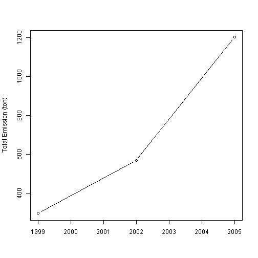

## The dataset

1. Fine particulate matter (PM2.5) ambient air pollutant sample dataset from Environmental Protection Agency
2. Being used in the Exploratory Data Analysis Course of Coursera
3. Made some pre-processing to increase the speed of app

--- .class #id 

## The column type

```
##   fips Emissions  type
## 1 9001    15.714 POINT
## 2 9001   234.178 POINT
## 3 9001     0.128 POINT
## 4 9001     2.036 POINT
## 5 9001     0.388 POINT
## 6 9001     1.490 POINT
```


1. fips: A five-digit number (represented as a string) indicating the U.S. county  dataset from Environmental Protection Agency. Reference site: http://www.epa.gov/enviro/html/codes/state.html.
2. Emissions: The emissions of different types in ton.
3. type: The type of source. (point, non-point, on-road, or non-road)
4. After the input of variable, press the process button to calculate the results

--- .class #id 


## The result

 

1. After the calculation. There is a plot that show the emission change during time.


--- .class #id 

## Reference

1. Shiny app: http://sealer22.shinyapps.io/DevelopDataProduct
2. Source code: https://github.com/sealer22/DevelopDataProduct
3. Document: https://github.com/sealer22/DevelopDataProduct/blob/master/How_to_use_the_shiny_app.pdf
4. Slide: 


